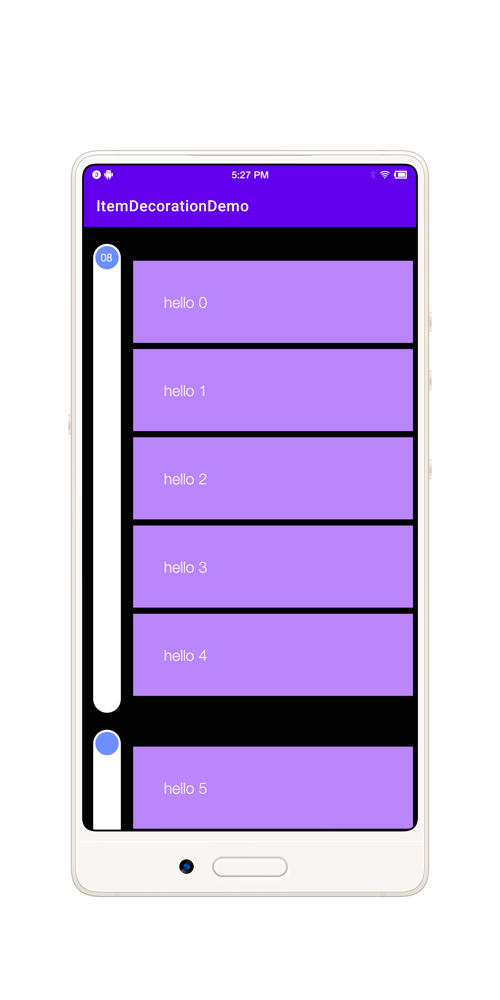

### 🍓 通过 ItemDecoration 实现的时间线并带有粘性头部效果

#### 运行效果



### 使用

```
      recyclerView.addItemDecoration(
            DateLineItemDecoration.Builder()
                .timeLineBgColor(Color.WHITE)
                .textColor(Color.WHITE)
                .textCircleBgColor(Color.GREEN)
                .textColor(Color.RED)
                .getSectionInfo {
                    DateLineItemDecoration.Section().apply {
                        isFirst = true
                        isEnd = true
                        date = if (it < 10) {
                            "0$it"
                        } else {
                            "$it"
                        }
                    }
                }
                .build(this)
        )
```

